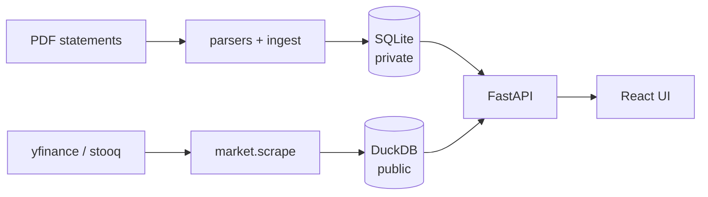
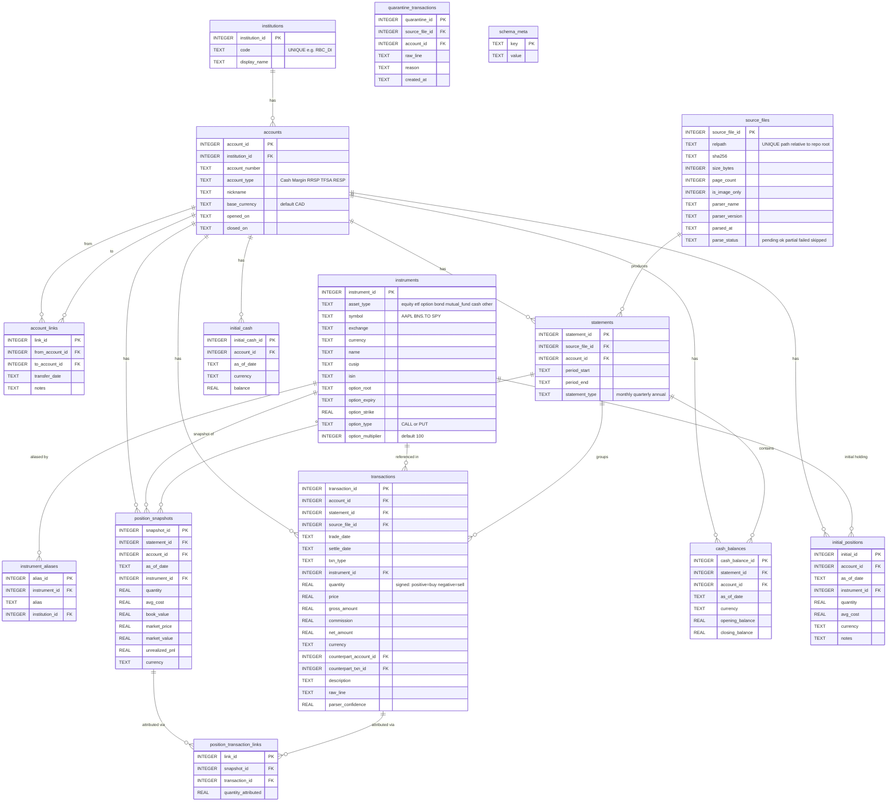
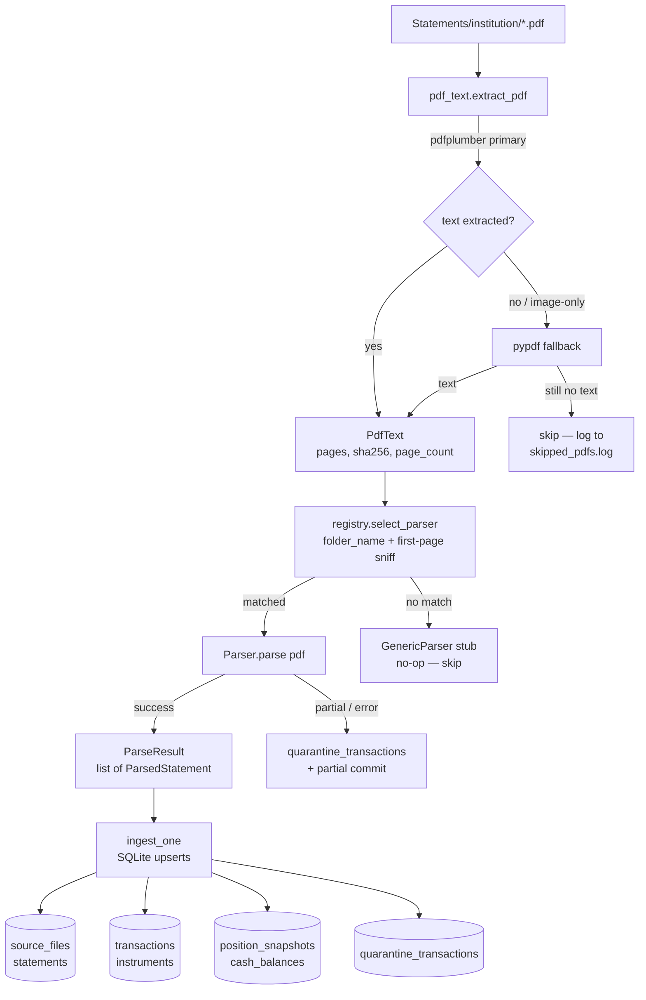
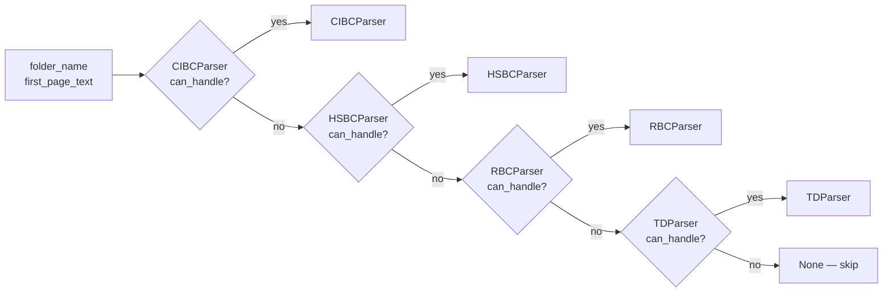
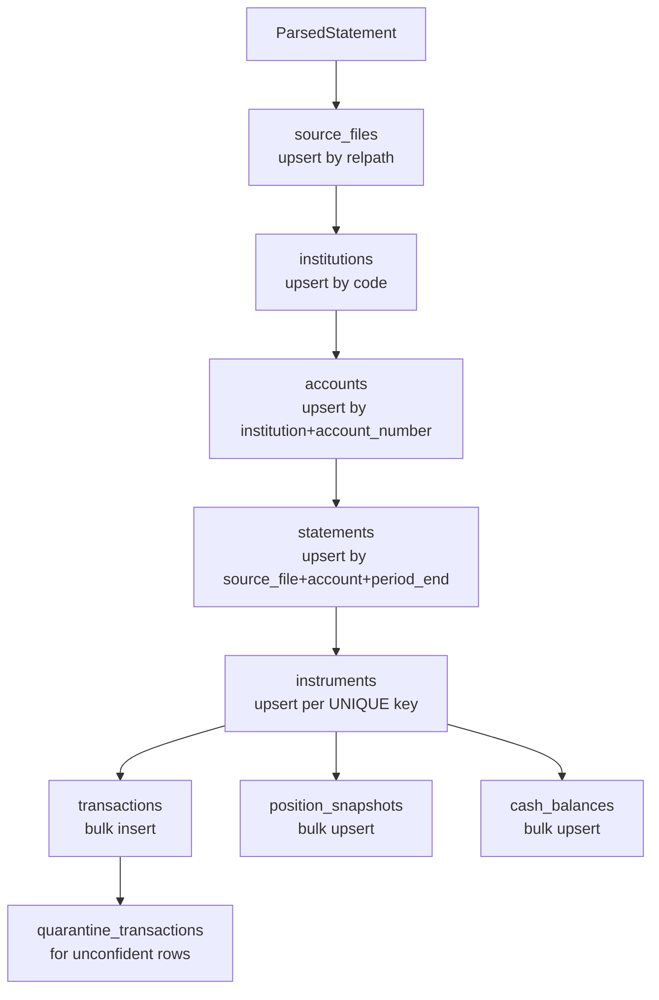
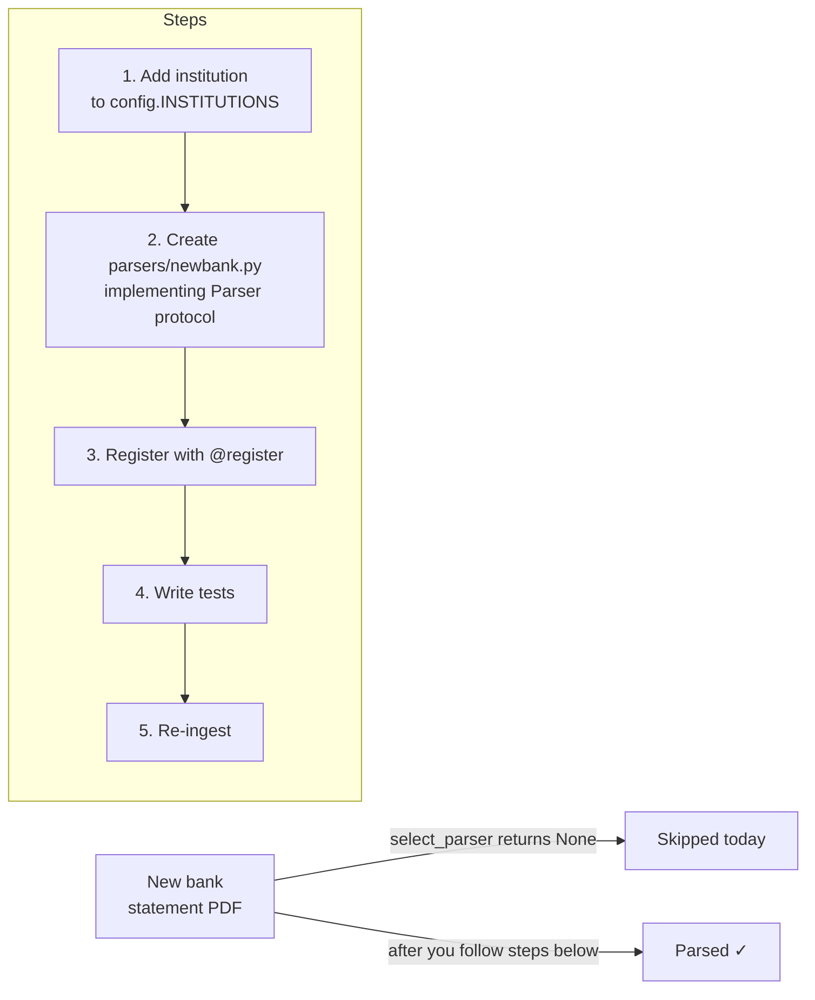
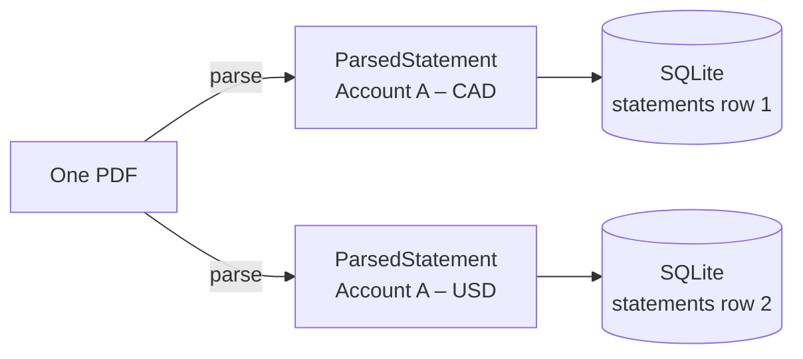
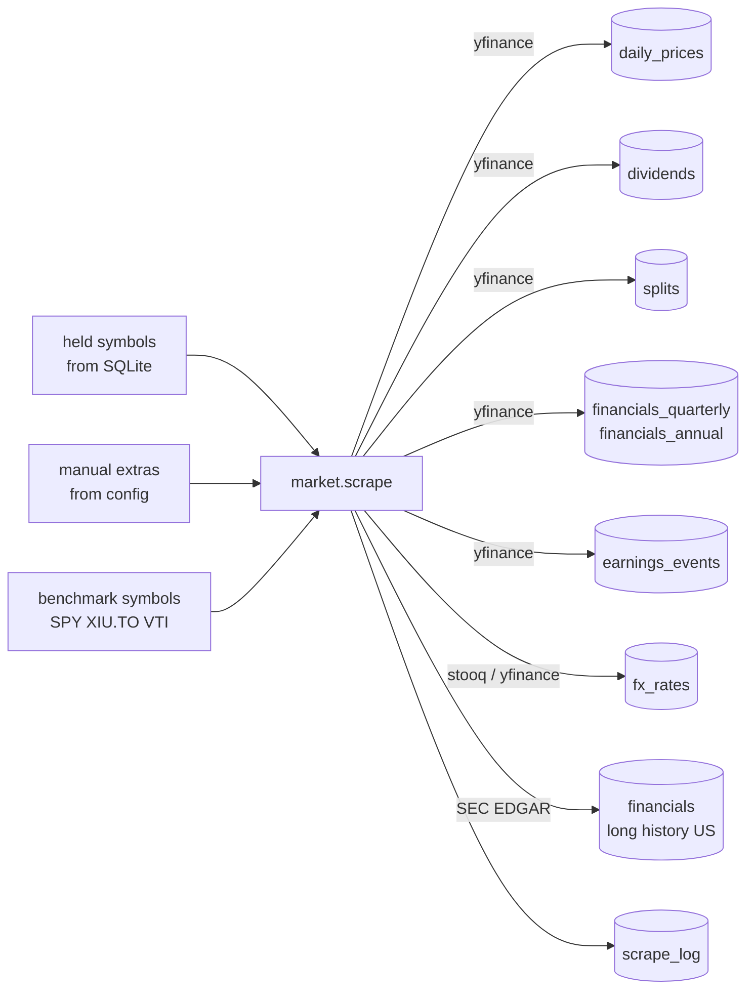

# Architecture

This document is the authoritative description of how data flows through
the **ledger** app. [AGENTS.md](AGENTS.md) intentionally stays short
(AI-ops rules only) and points here for any structural detail.

The app has three core data planes:

1. **Private SQLite** — your statements, transactions, holdings, cash.
2. **Public DuckDB** — market data (prices, dividends, splits, financials, FX).
3. **JSON config** — user preferences (portfolios, theme, language, LLM keys).



---

## 1. SQLite schema (private)

The canonical DDL lives in [src/ledger/db/schema.sql](src/ledger/db/schema.sql).
This section explains *why* it's shaped the way it is and documents every
table and its columns.

### 1.1 Why multi-currency everywhere?

Every monetary column is paired with a `currency` column. Cash is tracked
per `(account, currency)`. Reasons:

- A Canadian discount-brokerage account can hold both CAD and USD cash legs
  simultaneously. The statement reports each leg in its native currency.
- FX rates change daily. If we stored a CAD-equivalent at ingest time it
  would be frozen at the wrong rate by the time the user views it.
- Performance reports must be reproducible. Converting on the fly from
  `fx_rates` (DuckDB) gives the same number on any future view.

**Rule:** ingest stores native amounts. FX is presentation-only.

### 1.2 Why are options first-class instruments?

`instruments.asset_type` enumerates
`equity / etf / option / mutual_fund / bond / cash / other`.
Option rows carry `option_root`, `option_expiry`, `option_strike`,
`option_type`, `option_multiplier`.

The **UNIQUE** key includes the option fields, so:

- `AAPL` (the equity) and `PUT AAPL JAN 15 2027 200` (one of many options)
  are *separate* rows with a stable shared `option_root = AAPL`.
- The same underlying with different strikes/expiries does not collide.
- The Research tab can pull either by symbol+root.

The 100× multiplier is stored on each option row so future contracts with
non-standard multipliers (split-adjusted) can be represented faithfully.

### 1.3 Why split `source_files` from `statements`?

`source_files` is **one row per PDF on disk** — fingerprinted by
`sha256`. `statements` is **one row per (account, period)** *snapshot*
emitted by parsing that PDF.

One PDF can legitimately produce multiple `statements` rows because:

- **RBC** statements pack CAD-currency and USD-currency sections into a
  single PDF; each is its own statement.
- **TD WebBroker** prints `<acct>-CDN` and `<acct>-USD` sub-statements in
  one PDF.
- **HSBC** fee-summary PDFs cover multiple periods at once.

Splitting the model lets re-ingest stay idempotent (the file is unchanged,
the derived snapshots are recomputed) and lets reports group by
`(account_id, period_end)` without re-parsing.

### 1.4 Transactions, snapshots, and the reconciliation gap

Two parallel tables converge on the same ground truth from different
angles:

- `transactions` — the *events* (buy, sell, dividend, option roll, …).
- `position_snapshots` — the *state at the end of each statement*.

Holdings on statement dates come from `position_snapshots`. For an
arbitrary historical date, the Monthly API uses the latest complete
statement for each account as a checkpoint, then replays signed
transactions after that checkpoint up to the selected day. Before the
first available statement, it starts from `initial_positions` and replays
transactions forward. The Performance route still forward-fills account
snapshots to avoid zig-zag when account statement dates are staggered.

**Why snapshots still matter:** brokers sometimes apply lot adjustments,
splits, name changes, and book-cost roll-ups that *only* appear on the
snapshot side. Treating broker snapshots as checkpoints makes the app
robust to those adjustments while transactions remain the audit trail.

`initial_positions` and `initial_cash` are for the period *before* the
first available statement — they let you record or infer an opening
balance for holdings that pre-date your earliest PDF.

### 1.5 In-kind transfers between MY accounts

When a holding moves from CIBC Investor's Edge to a CIBC TFSA, both
statements show one half of the move. The schema captures both:

- `account_links` — date-level link (transfer_date, from, to, notes).
- `transactions.counterpart_account_id` / `counterpart_txn_id` —
  event-level pairing.

This lets the Performance and Monthly tabs trace a lot across accounts
without double-counting cash.

### 1.6 The quarantine principle

Any unparseable line goes to `quarantine_transactions` with
`raw_line + reason`. **We never fabricate a transaction.** A confidence
score below 1.0 is allowed in `transactions.parser_confidence`, but
every recorded row must be defensible against the source PDF.

The mirror file [logs/quarantine.jsonl](logs/quarantine.jsonl) is
the same content for grep-friendly investigation.

---

## 2. SQLite schema — detailed table reference

The full entity-relationship structure of the private database:



### 2.1 Key constraints and indexes

| Table | UNIQUE constraint | Key indexes |
|---|---|---|
| `institutions` | `code` | — |
| `accounts` | `(institution_id, account_number)` | — |
| `instruments` | `(asset_type, symbol, currency, option_expiry, option_strike, option_type)` | `idx_instruments_symbol` |
| `instrument_aliases` | `(alias, institution_id)` | — |
| `source_files` | `relpath` | — |
| `statements` | `(source_file_id, account_id, period_end)` | `idx_statements_account_period` |
| `transactions` | — | `idx_txn_account_date`, `idx_txn_instrument`, `idx_txn_type`, `idx_txn_statement` |
| `position_snapshots` | `(statement_id, instrument_id)` | `idx_pos_account_date` |
| `cash_balances` | `(statement_id, currency)` | `idx_cash_account_date` |
| `initial_positions` | `(account_id, as_of_date, instrument_id)` | — |
| `initial_cash` | `(account_id, as_of_date, currency)` | — |
| `position_transaction_links` | `(snapshot_id, transaction_id)` | — |

### 2.2 Transaction type vocabulary

Every transaction's `txn_type` must be one of these literals (enforced by the parser protocol):

```
buy / sell / short_sell / buy_to_cover
option_buy_to_open / option_sell_to_open
option_buy_to_close / option_sell_to_close
option_assignment / option_exercise / option_expiration
dividend / distribution / interest_income
interest_expense / margin_interest
transfer_in / transfer_out / journal
deposit / withdrawal
tax_withholding
fee / commission / adjustment / fx_conversion
stock_split / name_change / spinoff / merger / return_of_capital
```

Adding a new type requires updating both the literal *and* the analytics
that switch on it (Monthly, Performance, Research).

---

## 3. DuckDB schema (public)

DDL: [src/ledger/db/duckdb_store.py](src/ledger/db/duckdb_store.py).

```mermaid
erDiagram
    daily_prices {
        TEXT symbol PK
        DATE trade_date PK
        REAL open
        REAL high
        REAL low
        REAL close
        REAL adj_close
        BIGINT volume
    }

    dividends {
        TEXT symbol PK
        DATE ex_date PK
        REAL amount
        TEXT currency
    }

    splits {
        TEXT symbol PK
        DATE split_date PK
        REAL ratio
    }

    option_implied_vol {
        TEXT symbol PK
        DATE trade_date PK
        REAL atm_iv
    }

    fx_rates {
        TEXT pair PK "e.g. USDCAD"
        DATE trade_date PK
        REAL rate
    }

    financials_quarterly {
        TEXT symbol PK
        DATE period_end PK
        REAL revenue
        REAL net_income
        REAL free_cash_flow
        REAL eps
    }

    financials_annual {
        TEXT symbol PK
        DATE period_end PK
        REAL revenue
        REAL net_income
        REAL free_cash_flow
        REAL eps
    }

    earnings_events {
        TEXT symbol PK
        DATE event_date PK
        REAL eps_estimate
        REAL eps_actual
    }

    scrape_log {
        TEXT symbol PK
        TEXT kind PK
        TIMESTAMP fetched_at
        TEXT status
        TEXT message
    }

    symbol_profiles {
        TEXT symbol PK
        TEXT sector
        TEXT industry
        TEXT display_name
        TEXT country
        TIMESTAMP fetched_at
    }
```



Every table has a natural-key `PRIMARY KEY` so a re-scrape upserts and
never doubles rows.

### 3.1 Why DuckDB instead of more SQLite?

- Market data is bulk-append columnar data. DuckDB's columnar
  storage + Parquet-style compression handles 15+ years of daily prices
  for hundreds of symbols in tens of MB.
- DuckDB ships full SQL window functions and resampling, which the
  Research tab uses for weekly/monthly OHLC roll-ups.
- It runs in-process so the FastAPI server doesn't need a separate
  database server.

### 3.2 Why is it separate from the private DB?

The DuckDB file is **safe to publish or share** — it has no personal
information. Splitting it makes it trivial to: redact a snapshot for
support, ship the example dataset with empty market data, or scrape
opportunistically without contaminating the private store.

---

## 4. Ingestion pipeline

### 4.1 High-level flow



Entry point: `ledger ingest run` (see [src/ledger/ingest/pipeline.py](src/ledger/ingest/pipeline.py)).

### 4.2 Idempotency

Re-running ingest on the same PDF is safe because:

1. `source_files` is keyed on `relpath` — the row is updated, not duplicated.
2. `sha256` is compared before re-parsing; an unchanged file is a no-op.
3. Every derived table (`statements`, `transactions`, `position_snapshots`,
   `cash_balances`) upserts by its natural key, so stale rows are replaced,
   not appended.

### 4.3 The Parser protocol

```python
class Parser(Protocol):
    NAME: str
    VERSION: str
    def can_handle(self, folder_name: str, first_page_text: str) -> bool: ...
    def parse(self, pdf: PdfText) -> ParseResult: ...
```

Contracts:

- **Deterministic.** Two runs on the same PDF produce byte-identical
  output (so re-ingest doesn't churn rows).
- **Side-effect free.** Parsers emit dataclasses from
  [parsers/types.py](src/ledger/parsers/types.py); the ingest
  pipeline owns *all* DB writes.
- **Multi-statement aware.** Every parser returns
  `list[ParsedStatement]` inside `ParseResult` to handle multi-account
  and multi-period PDFs.

### 4.4 Parser selection

`select_parser(folder_name, first_page_text)`:

1. Iterate `_REGISTRY` (populated by `@register` decorators at import time).
2. For each registered parser call `p.can_handle(folder_name, head)` — the
   first match wins.
3. `can_handle` typically checks `folder_name` against a known constant and
   optionally sniffs the first-page text for a parser-specific signature.
4. If no parser matches, returns `None` → the pipeline skips the file.



### 4.5 What `ingest_one` writes

For each `ParsedStatement` returned by a parser, `ingest_one` writes in
dependency order:



### 4.6 Per-institution format notes

| Institution | Folder | Quirks |
|---|---|---|
| CIBC Imperial Service | `CIBC Imperial Service/` | Monthly. `ð` PDF artifact replaced with em-dash. `(continued)` headers ignored when splitting sections. |
| CIBC Investor's Edge | `CIBC Invest Direct/` | Monthly. `Tax-Document_*.pdf` skipped. Option expiry `MM/DD/YY`. |
| CIBC TFSA | `CIBC TSFA/` | Same engine as CIBC IE; account-type heuristic detects TFSA. |
| HSBC Direct Invest | `HSBC direct invest/` | pdfplumber drops spaces; `_normalize()` re-inserts space after `MmmDD`. Compact options `PUT-100TLT'2616JA@75`. Multi-account per PDF. |
| RBC Direct Investing | `RBC Invest Direct/` | One PDF holds CAD + USD statements → 2 `ParsedStatement` rows. Full month names. Trailing-hyphen negatives. |
| TD WebBroker | `TD Webbroker/` | Two sub-accounts per PDF (`<acct>-CDN` / `<acct>-USD`). Option positions span two lines. Legacy 2016-2017 quarterly format. |

### 4.7 Symbol resolution (and synthetic symbols)

Statements frequently identify a security by a free-form name with no
parens-ticker. The app's strategy, in order:

1. **Parens ticker** — if `(AAPL.NASDAQ)` appears, use it.
2. **Inline option spec** — if `CALL SOXS JAN 16 2026 55.00` appears,
   build an option instrument directly.
3. **Known-name map** — see
   [parsers/name_resolver.py](src/ledger/parsers/name_resolver.py).
   E.g. `ISHARES 20 PLUS YEAR TREASURY → TLT`.
4. **Statement holding correlation** — `ledger ingest repair-symbols`
  rewrites stale transaction instruments by matching the transaction
  description/quantity/date to the same statement's `position_snapshots`.
  Tax-withholding rows inherit the nearest same-day dividend instrument.
  `ingest run` performs this repair automatically after parsing.
5. **Synthetic symbol** — strip leading verbs (`BOUGHT`/`SOLD`/...) and
   join the first 4 words with underscores. These synthetic symbols are
   filtered out of `market.scrape._held_symbols` by a strict regex so
   yfinance is never asked for `BOUGHT_ISHARES_20_PLUS`.

This keeps the audit trail honest: the description always matches the
PDF, even if the canonical ticker can't be inferred.

### 4.8 Logs

- `logs/ingest.log` — main run.
- `logs/parser_<institution>.log` — per-parser detail.
- `logs/skipped_pdfs.log` — image-only PDFs we skip (no OCR).
- `logs/quarantine.jsonl` — same content as `quarantine_transactions`.

---

## 5. Adding a parser for a new bank

### 5.1 Overview

When the ingestion pipeline encounters a PDF from an institution it has
never seen before, `select_parser` returns `None` and the file is
silently skipped. To add support for a new bank you implement the
`Parser` protocol, register it, and register the folder mapping.



### 5.2 Step-by-step

**Step 1 — Register the institution folder**

In [src/ledger/config.py](src/ledger/config.py), add the institution code
and its `Statements/` subfolder name to `INSTITUTIONS`:

```python
INSTITUTIONS = {
    "CIBC_IS":  "CIBC Imperial Service",
    "CIBC_IE":  "CIBC Invest Direct",
    # ... existing entries ...
    "NEWBANK":  "New Bank Direct",   # ← add this
}
```

**Step 2 — Create the parser module**

Create `src/ledger/parsers/newbank.py`:

```python
from __future__ import annotations
from ..pdf_text import PdfText
from .types import ParseResult, ParsedStatement, ParsedTransaction, TxnType
from .registry import register

FOLDER = "New Bank Direct"

@register
class NewBankParser:
    NAME = "newbank"
    VERSION = "1"

    def can_handle(self, folder_name: str, first_page_text: str) -> bool:
        return folder_name == FOLDER or "New Bank Direct Investing" in first_page_text

    def parse(self, pdf: PdfText) -> ParseResult:
        statements: list[ParsedStatement] = []
        # ... parse logic ...
        return ParseResult(statements=statements)
```

Key rules for the parser body:

- Extract `period_start` and `period_end` from the statement header.
- Emit one `ParsedStatement` per `(account_number, period_end)`.
- Every transaction must have `trade_date`, `txn_type` (from
  `TxnType`), and either `instrument_id`/`symbol` or
  `description`.
- Rows you can't confidently parse go into `ParsedStatement.quarantine`
  with `raw_line` and a human-readable `reason` — **never fabricate**.
- Set `parser_confidence < 1.0` on rows you parsed but are uncertain
  about; keep them in `transactions`, not quarantine.

**Step 3 — Register at import time**

Import the new module in [src/ledger/parsers/\_\_init\_\_.py](src/ledger/parsers/__init__.py)
so the `@register` decorator fires before `select_parser` is called:

```python
from . import cibc, hsbc, rbc, td, newbank   # ← add newbank
```

**Step 4 — Write tests**

Create `tests/test_newbank.py`. At minimum, provide a fixture text
corpus (redacted or synthetic) that covers:

| Scenario | Why |
|---|---|
| `buy` | Core transaction |
| `sell` | Sign inversion |
| `dividend` | Cash credit |
| `option_buy_to_open` | Option parsing |
| `option_expiration` | Zero-quantity close |
| `cash_balance` row | Closing balance |
| An unparseable line | Quarantine path |

**Step 5 — Re-ingest and verify**

```powershell
uv run ledger ingest run
# check quarantine count didn't spike
uv run python -c "
import sqlite3; c=sqlite3.connect('data/ledger.sqlite')
print(c.execute('SELECT COUNT(*) FROM quarantine_transactions').fetchone())
"
uv run pytest -q
```

### 5.3 LLM-assisted draft parser

For PDFs with an unfamiliar layout, the prompt skill in
[prompts/new-parser.md](prompts/new-parser.md) walks an LLM through
producing a draft parser from a text dump of the PDF. Use
`uv run python scripts/dump_sample.py <pdf_path>` to generate the text
dump, then feed it to the prompt.

### 5.4 Multi-account PDFs

If a single PDF contains statements for more than one account (like HSBC
or RBC), `parse()` must return one `ParsedStatement` per account per
period. The pipeline handles the fan-out automatically; it calls
`ingest_one(parsed_stmt)` in a loop.



---

## 6. Market data pipeline



Entry point: `ledger market scrape` (see
[src/ledger/market/scrape.py](src/ledger/market/scrape.py)).

### 6.1 What gets scraped

1. **Symbol universe** = `_held_symbols(sqlite)` ∪ benchmarks (`SPY`,
   `XIU.TO`, `VTI`, configurable) ∪ `--symbol` CLI overrides.
2. Synthetic symbols are filtered out by a strict regex
   (`^[A-Z][A-Z0-9-]{0,8}(\.[A-Z]{1,3})?$`) plus a blocklist
   (`BOUGHT`, `CASH`, `CAD`, …).
3. For each surviving symbol:
   - Daily OHLCV from yfinance (default lookback 15 years).
   - Symbol profiles/sector metadata (yfinance `info`).
   - Dividends and splits (yfinance accessors).
   - Quarterly and annual financials (yfinance, extended with SEC EDGAR
     Company Facts for US-listed symbols when available).
   - Earnings events (yfinance).
4. FX pairs: USD/CAD, EUR/USD, etc. (configurable).

### 6.2 Rate limiting and retries

yfinance is unofficial and rate-limited. The scraper:

- Sleeps `--per-folder` seconds between symbols (default 2s).
- Retries on `HTTPError 429` with exponential backoff, max 3 attempts.
- Writes every attempt to `logs/market_scrape.jsonl` (one JSON line per
  request) so partial runs can be resumed.

### 6.3 Idempotency

Every DuckDB table has a natural-key `PRIMARY KEY`. The scraper uses
`INSERT OR REPLACE`, so re-running on an existing DB is safe and only
updates the most recent rows. `scrape_log` records `(symbol, kind,
fetched_at, status)` so the CLI can show "what's stale" without
hitting yfinance.

`symbol_profiles` stores public profile metadata such as sector and
industry. Visualization endpoints join it opportunistically; if profile
data has not been refreshed yet, charts still render and use neutral
fallback colors.

### 6.4 Why yfinance and not a paid feed?

- Free. The app is personal.
- Covers >99% of symbols a Canadian retail investor would hold.
- Returns split- and dividend-adjusted close, which is the right
  signal for the Performance tab.

Drawbacks:

- Unofficial — API can break with no notice.
- yfinance fundamentals are short-history; US-listed symbols are extended
  through the free SEC EDGAR Company Facts API when available.
- No option chains. (Deferred.)

Candidates for additional backup feeds if yfinance breaks:

- [stooq.com](https://stooq.com) (free CSV downloads, 25+ years).
- [SEC EDGAR companyfacts API](https://www.sec.gov/edgar/sec-api-documentation)
  (already used for longer-history fundamentals, US only).
- [Alpha Vantage](https://www.alphavantage.co) (free tier, daily limit).

---

## 7. Config / portfolios

Stored as `<DATA_DIR>/config.json`. Schema:

```jsonc
{
  "portfolios": [
    { "id": "all",     "name": "All accounts",   "account_ids": [] },
    { "id": "dad",     "name": "Dad's TFSA",     "account_ids": [3, 7] },
    { "id": "kids",    "name": "Kids' RESPs",    "account_ids": [9] }
  ],
  "active_portfolio": "all",
  "theme": "dark",
  "display_currency": "CAD",
  "hide_money": false,
  "language": "en"
}
```

The frontend reads it via `GET /config` and writes via `PUT /config`.
A portfolio with empty `account_ids` is implicitly "all accounts".

---

## 8. Workspace profiles

Configured by env var, read on module load by
[config.py](src/ledger/config.py):

| `LEDGER_PROFILE` | `STATEMENTS_DIR`     | `DATA_DIR`            | Purpose |
|---|---|---|---|
| `real` (default) | `Statements/`        | `data/`               | Your real statements |
| `example`        | `example_data/Statements/` | `example_data/data/`  | Synthetic demo data |

Override individual paths with `LEDGER_DATA_DIR` /
`LEDGER_STATEMENTS_DIR` for ad-hoc runs.

The example dataset is rebuilt by:

```powershell
$env:LEDGER_PROFILE = "example"
uv run python scripts/build_example_data.py
```

---

## 9. Required validation after structural changes

```powershell
uv run pytest -q
uv run ruff check src tests
cd frontend; npm run build
```

Spot-check parser output against the corresponding PDF; every reported
transaction must be defensible against the source.
