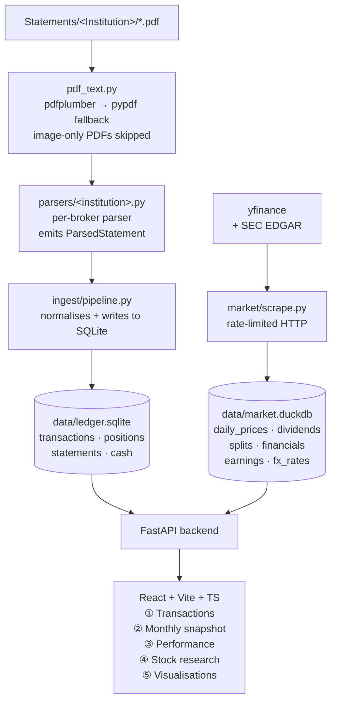

# Ledger — Personal Multi-Broker Trading History & Analytics

A from-scratch pipeline + web app to consolidate every brokerage statement I
have (CIBC Imperial Service, CIBC Investor's Edge, CIBC TFSA, HSBC Direct
Invest, RBC Direct Investing, TD WebBroker) into one coherent database, then
visualize positions, P&L, performance and per-ticker research.

> Status: under active construction. See `AGENTS.md` for the in-progress
> implementation plan and conventions.

## High-level architecture



## Database split

Two stores, deliberately separated:

- **SQLite — `data/ledger.sqlite`**: my private trading data. Multi-currency
  by design. Tables: `institutions`, `accounts`, `account_links`,
  `instruments`, `instrument_aliases`, `source_files`, `statements`,
  `transactions`, `quarantine_transactions`, `position_snapshots`,
  `cash_balances`, `initial_positions`, `initial_cash`,
  `position_transaction_links`. Schema is in
  [src/ledger/db/schema.sql](src/ledger/db/schema.sql).
- **DuckDB — `data/market.duckdb`**: public market data scraped on demand.
  Tables: `daily_prices`, `dividends`, `splits`, `option_implied_vol`,
  `fx_rates`, `financials_quarterly`, `financials_annual`,
  `earnings_events`, `scrape_log`. Defined in
  [src/ledger/db/duckdb_store.py](src/ledger/db/duckdb_store.py).

Cash balances are tracked per `(account, currency)` so CAD and USD never get
mixed at ingest. FX conversion is a presentation-layer concern.

## Quick start

```powershell
# 1. install
uv sync

# 2. initialise both DBs
uv run ledger db init

# 3. dump first-page text of every statement (used to design parsers)
uv run ledger pdf dump-samples

# 4. ingest all statements
uv run ledger ingest run

# 5. scrape market data for every held ticker
uv run ledger market refresh

# 6. start backend
uv run uvicorn ledger.api.app:app --reload

# 7. start frontend
cd frontend && npm install && npm run dev
```

All scripts log to `logs/<command>.log` (and JSONL where structured).

## Folder layout

```
trade_history_opus47/
├── AGENTS.md            ← agent rules + architecture deep-dive
├── README.md
├── pyproject.toml
├── data/                ← SQLite + DuckDB live here (git-ignored)
├── logs/                ← every script writes here (git-ignored)
├── Statements/          ← raw PDFs per institution (git-ignored)
├── scripts/             ← one-shot CLIs (refresh, ingest, scrape)
├── src/ledger/
│   ├── config.py
│   ├── logging_setup.py
│   ├── pdf_text.py
│   ├── cli.py
│   ├── db/              ← schema + sqlite/duckdb helpers
│   ├── parsers/         ← one sub-package per institution
│   ├── ingest/          ← orchestrates parser → DB
│   ├── market/          ← yfinance + scraping for DuckDB
│   ├── analytics/       ← P&L, asset value, sector rotation, correlation
│   └── api/             ← FastAPI app + routes
├── frontend/            ← React + Vite + TS, Plotly
└── tests/
```

## Frontend tabs

1. **Transactions** — every txn across every account; filterable by date,
   account, institution, ticker and type.
2. **Monthly** — pick any month-end and view the consolidated holdings
   snapshot; diff two months side-by-side.
3. **Performance** — total asset value over time; filter by account /
   institution / ticker / asset class.
4. **Stock research** — clicking any symbol anywhere drills in here:
   candlestick price chart with 50/200 MA toggles + my buy/sell markers,
   volume sub-chart, then quarterly financial-statement chart with
   per-line visibility toggles. Daily/weekly/monthly switch.
5. **Visualisations** — sector rotation (RRG) with date scrubber + play
   button, treemap by sector, collapsible correlation matrix. Each view
   is animatable across history.

## Data quality rule

Correctness > completeness. Any ambiguous statement line goes to
`quarantine_transactions` with `raw_line` + reason, never silently dropped
and never partially fabricated.
