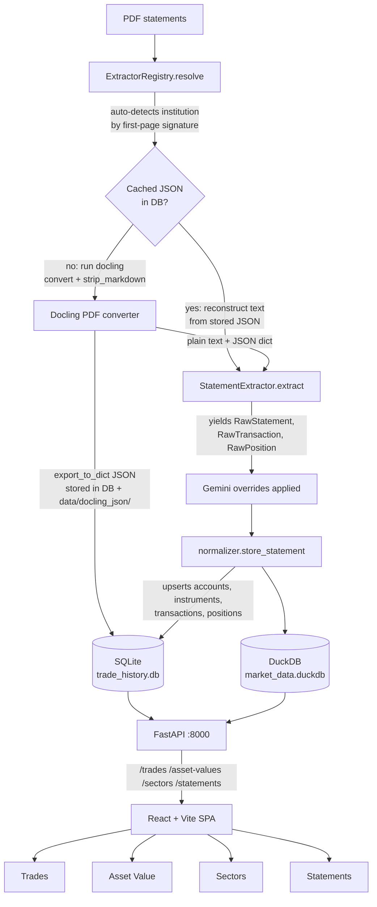

# Trade History

Investment trade-history database and performance dashboard. Ingests **324 PDF brokerage statements** (2016–2026) from 6 accounts across 4 institutions, stores normalised data in SQLite + DuckDB, and serves a React/Vite/TypeScript frontend via a FastAPI backend.

---

## Supported institutions

| Institution | Product | Account types | Currencies | Statement folder |
| --- | --- | --- | --- | --- |
| CIBC | Investors Edge | Margin, TFSA | CAD + USD | `Statements/CIBC Invest Direct/` |
| CIBC | Imperial Service | Managed | CAD | `Statements/CIBC Imperial Service/` |
| HSBC | InvestDirect | Margin | CAD + USD | `Statements/HSBC direct invest/` |
| RBC | Direct Investing | Margin | CAD + USD | `Statements/RBC Invest Direct/` |
| TD | WebBroker | Margin | CAD + USD | `Statements/TD Webbroker/` |

---

## Quick start (native)

```bash
# 1. Install Python deps
uv sync

# 2. Copy and edit env
cp .env.example .env
# Edit STATEMENTS_DIR if statements are not in ./Statements

# 3. Ingest all statements
uv run trade-history ingest statements

# 4. Start backend
uv run trade-history serve --reload
# → http://localhost:8000

# 5. Start frontend dev server (separate terminal)
cd frontend && npm install && npm run dev
# → http://localhost:5173  (proxies /api/* → :8000)
```

## Quick start (Docker)

```bash
docker compose up --build
# → http://localhost:8000  (API + built SPA)
```

---

## Common commands

```bash
# Python — always via uv
uv sync                                          # install / refresh deps
uv run trade-history ingest statements           # ingest all statements
uv run trade-history ingest statements --force   # re-ingest after parser changes
uv run trade-history ingest statements --dry-run # parse only, no DB writes
uv run pytest -q                                 # run all tests
uv run ruff check src tests                      # lint

# Frontend
cd frontend && npm install
npm run dev          # dev server with HMR
npm run build        # production build (run before pushing)

# Gemini-assisted parser corrections
bash scripts/gemini_extract_samples.sh           # writes data/gemini_overrides/…
```

---

## Architecture

### Data flow



### Directory layout

```text
trade_history_opus46/
├── pyproject.toml              # uv project; entry point: trade-history
├── Dockerfile                  # multi-stage: Node build → Python image
├── docker-compose.yml
├── .env.example
├── src/trade_history/
│   ├── cli.py                  # click CLI
│   ├── db/
│   │   ├── schema.sql          # canonical SQLite DDL (6 tables)
│   │   ├── sqlite.py           # connection, migrations, upsert helpers
│   │   └── duckdb.py           # OHLCV + FX store
│   ├── extractors/
│   │   ├── base.py             # RawStatement / RawTransaction / RawPosition dataclasses
│   │   ├── registry.py         # @ExtractorRegistry.register decorator
│   │   ├── utils.py            # docling/pdfplumber PDF conversion, JSON cache, option parsers, amount parsers
│   │   ├── cibc/investors_edge.py    # Invest Direct + TFSA
│   │   ├── cibc/imperial_service.py  # Managed (mutual funds only)
│   │   ├── hsbc/investdirect.py      # CAD + USD sub-accounts
│   │   ├── rbc/direct_investing.py   # handles old + new statement formats
│   │   └── td/webbroker.py           # quarterly + monthly statement formats
│   ├── ingest/
│   │   ├── pipeline.py         # discover → extract → normalize → store
│   │   ├── normalizer.py       # raw → canonical DB rows
│   │   ├── transfer.py         # match inter-account transfer pairs
│   │   ├── docling_linker.py   # link transactions to docling source cells
│   │   └── overrides.py        # apply Gemini corrections
│   ├── market/
│   │   ├── prices.py           # yfinance → DuckDB OHLCV
│   │   └── fx.py               # USD/CAD FX rates → DuckDB
│   ├── analytics/
│   │   ├── pnl.py              # FIFO realised P/L
│   │   ├── positions.py        # open position computation
│   │   └── monthly.py          # materialize monthly balance snapshots
│   └── api/
│       ├── main.py             # FastAPI app + static SPA serving
│       ├── deps.py             # DB dependency injectors
│       └── routes/
│           ├── trades.py       # GET /trades
│           ├── assets.py       # GET /asset-values
│           ├── sectors.py      # GET /sectors
│           ├── monthly.py      # GET /monthly-balances
│           └── statements.py   # GET /statements, PDF serving
├── frontend/
│   ├── package.json
│   ├── vite.config.ts
│   └── src/
│       ├── App.tsx             # tab routing + global settings state
│       ├── App.css             # design tokens + utility classes
│       ├── i18n/               # en + zh-TW strings
│       ├── types/
│       │   └── docling.ts     # TypeScript types for docling JSON
│       └── pages/
│           ├── TradesTab.tsx   # sortable/filterable trade table
│           ├── AssetValueTab.tsx  # per-account stocks + options
│           ├── SectorsTab.tsx  # pie + bar sector allocation (recharts)
│           ├── StatementsTab.tsx  # statement viewer with PDF + JSON
│           ├── PdfViewer.tsx   # PDF.js renderer with docling overlays
│           └── DoclingJsonViewer.tsx  # structured docling JSON viewer
├── data/
│   ├── trade_history.db           # SQLite database
│   └── docling_json/              # cached docling JSON per PDF (by institution folder)
├── tests/
│   ├── extractors/
│   │   ├── test_utils.py       # amount/date/option parsers
│   │   └── test_registry.py    # can_handle() for all institutions
│   └── analytics/
│       ├── test_pnl.py         # FIFO P/L scenarios
│       └── test_positions.py   # open position accumulation
├── scripts/
│   └── gemini_extract_samples.sh   # AI-assisted correction of edge-case rows
└── .claude/commands/
    └── add-bank-extractor.md       # /add-bank-extractor skill
```

### SQLite schema

| Table | Purpose |
| --- | --- |
| `accounts` | Brokerage account registry; `group_key = institution \| account_id` |
| `instruments` | Equities and options; options carry `option_root`, `strike`, `expiry`, `put_call` |
| `transactions` | Individual fills; linked to `statement_registry` via `statement_id` |
| `transfer_pairs` | Matched inter-account transfers (preserve cost basis, no phantom P/L) |
| `position_state` | Computed open/closed positions as of statement date |
| `monthly_balances` | Monthly portfolio snapshots per account/instrument (materialized from `position_state`) |
| `quarantine_transactions` | Unparseable rows held for manual review |
| `statement_registry` | Ingestion audit log with opening/closing balances, validation status, and docling JSON; also saved to `data/docling_json/` |
| `description_symbol_map` | Institution-specific description-to-ticker mapping from holdings data |

### Option parsing

Each institution uses a different option description format:

| Institution | Example | Parser |
| --- | --- | --- |
| CIBC | `PUT AG JAN 19 2024 6` | `parse_cibc_option()` |
| HSBC | `PUT -100 TECK.B'23 SP@40` | `parse_td_option()` (TD-style compact format) / `parse_hsbc_option()` (legacy) |
| RBC | `CALL SHOP 01/20/23 700` / `PUT .BCE 03/21/25 40` | `parse_rbc_option()` |
| TD | `CALL-100 CNQ'25 JA@50` | `parse_td_option()` |

---

## CLI reference

```text
trade-history
├── ingest                          # Data ingestion commands
│   └── statements                  # Ingest all PDF brokerage statements
│       --statements-dir DIRECTORY  #   Directory containing PDFs (default: from .env)
│       --force                     #   Re-process already-ingested statements
│       --dry-run                   #   Parse only; do not write to DB
└── serve                           # Start the FastAPI server
    --host TEXT                     #   Bind address (default: 0.0.0.0)
    --port INTEGER                  #   Port number (default: 8000)
    --reload                        #   Auto-reload on code changes
```

### `trade-history ingest statements`

Discovers PDF files recursively under `--statements-dir`, auto-detects the institution via `ExtractorRegistry.resolve()`, extracts transactions/positions, normalises into SQLite, matches transfer pairs, and computes monthly balance snapshots.

| Option | Description |
| --- | --- |
| `--statements-dir DIR` | Root directory to scan for PDFs. Defaults to `STATEMENTS_DIR` in `.env`. |
| `--force` | Re-process files already in `statement_registry` (uses cached docling JSON to skip OCR). |
| `--dry-run` | Parse and print results without writing to the database. |

### `trade-history serve`

Launches the FastAPI backend. In development, use `--reload` for auto-restart on file changes. In Docker, the server also serves the built frontend SPA from `frontend/dist/`.

| Option | Default | Description |
| --- | --- | --- |
| `--host` | `0.0.0.0` | Network interface to bind to. |
| `--port` | `8000` | HTTP port. |
| `--reload` | off | Enable uvicorn auto-reload (dev only). |

---

## API endpoints

| Method | Path | Description |
| --- | --- | --- |
| GET | `/trades` | All fills; params: `currency`, `account_id`, `symbol`, `asset_type`, `activity`, `date_from`, `date_to`, `sort_by`, `sort_dir`, `limit`, `offset` |
| GET | `/asset-values` | Open positions; params: `group_by=account\|institution`, `currency`, `as_of_date` |
| GET | `/sectors` | Sector allocation percentages |
| GET | `/trades/count` | Trade count for pagination; same filters as `/trades` |
| GET | `/monthly-balances/months` | List available year-month values (newest first) |
| GET | `/monthly-balances` | Historical monthly positions; params: `year_month` (required, `YYYY-MM`), `group_by`, `currency` |
| GET | `/statements` | List statements; params: `institution`, `account_id`, `status` |
| GET | `/statements/accounts` | List accounts with processed statements |
| GET | `/statements/{id}` | Statement metadata + docling JSON |
| GET | `/statements/{id}/pdf` | Stream original PDF file |
| GET | `/health` | Health check |

---

## Frontend features

- **Trades tab** — sortable/filterable table with activity badges, amount sign colouring
- **Asset Value tab** — per-account groups, separate Stocks and Options sections, unrealised P/L colouring; Current / Monthly toggle with month selector for historical snapshots
- **Sectors tab** — pie chart + bar chart (switchable) with recharts; per-sector table
- **Statements tab** — split-view PDF viewer with docling bounding box overlays and JSON inspector; bidirectional highlighting between PDF boxes and JSON entries; click trade rows to navigate here
- **Global controls** — CAD/USD display currency · English / 繁體中文 language toggle (in header bar)

---

## Adding a new institution

Use the built-in Claude Code skill:

```bash
/add-bank-extractor
```

This will guide you through analysing a sample PDF and generating a fully-tested extractor module. The skill includes:

- A complete extractor template with all required methods
- Code snippets from all 5 existing extractors as reference
- Available utility functions (`parse_amount`, `parse_short_date`, option parsers, etc.)
- Common gotchas and lessons learned (balance line leaks, keyword matching, concatenated words)
- Test template

See [`.claude/commands/add-bank-extractor.md`](.claude/commands/add-bank-extractor.md) for the full reference.

### Extractor directory structure

```text
src/trade_history/extractors/<institution_slug>/
├── __init__.py           # empty
└── <product_slug>.py     # @ExtractorRegistry.register class
```

Then register via import in `src/trade_history/extractors/__init__.py`.

---

## Validation checklist

```bash
# After any parser or UI change:
uv run pytest -q
uv run ruff check src tests
cd frontend && npm run build

# After ingest, verify DB contents:
uv run python -c "
import sqlite3; c = sqlite3.connect('data/trade_history.db')
print('accounts:',   c.execute('SELECT institution, account_id FROM accounts').fetchall())
print('tx count:',   c.execute('SELECT COUNT(*) FROM transactions').fetchone())
print('quarantine:', c.execute('SELECT COUNT(*) FROM quarantine_transactions').fetchone())
print('equity:',     c.execute(\"SELECT COUNT(*) FROM instruments WHERE asset_type='equity'\").fetchone())
print('option:',     c.execute(\"SELECT COUNT(*) FROM instruments WHERE asset_type='option'\").fetchone())
"

# Docker:
docker compose up --build
curl http://localhost:8000/health
curl http://localhost:8000/trades | python -m json.tool | head -40
```

## Security / PII

Before every push, scan for PII (account numbers, addresses, secrets):

Scope: `src/`, `scripts/`, `tests/`, `frontend/src/`, `Dockerfile`, `docker-compose.yml`, `README.md`, `.env.example`

Exclude: `data/`, `Statements/`, `frontend/node_modules/`, `frontend/dist/`, `.venv/`
