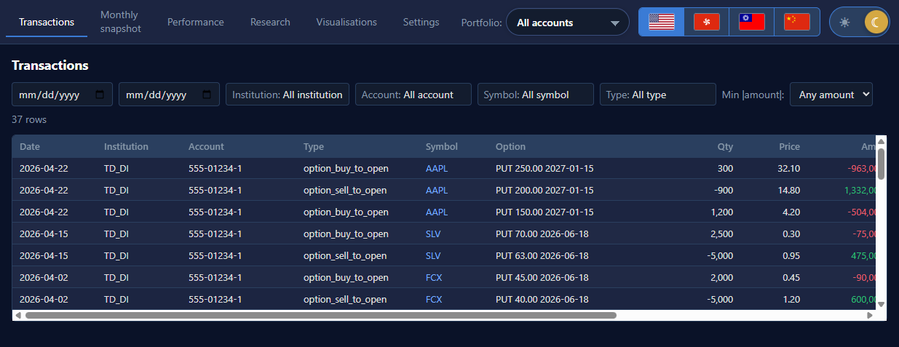
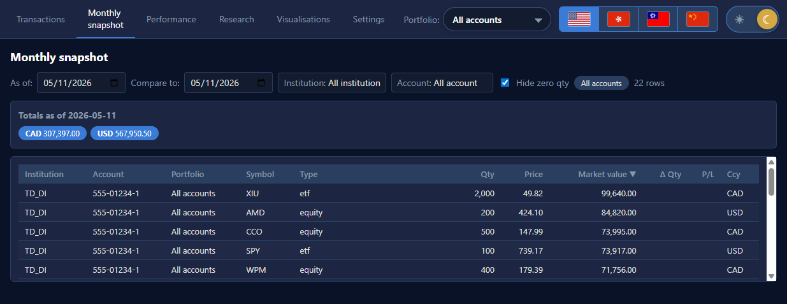

# Trade History — User Guide

A personal investment tracker for Canadian retail brokers. Imports your
monthly PDF statements from CIBC, HSBC, RBC, and TD, joins them against
free market data, and gives you a single dashboard for your whole
family's accounts.

This guide is written for **humans**. Technical context starts at
[INDEX.md](INDEX.md), while coding-agent rules live in
[AGENTS.md](../AGENTS.md).

> **Current data-quality notice (2026-07-18):** the GUI is operational and
> source ingestion preserves the prior active extraction if parsing or staging
> fails. Parser v2 fixes the audited RBC dual-currency and TD bundled layouts,
> and the CLI now persists month-end reconciliation results. A non-live shadow
> rebuild and comparison report exist, but the live ledger has not been cut
> over. Verify and Monthly display read-only quality states when v6 facts are
> present; historical live rows can still be unavailable. Review
> [CURRENT-STATE.md](CURRENT-STATE.md) before relying on totals as reconciled.

---

## 1. Install

```powershell
# clone, then from the repo root:
uv sync --all-extras --dev
cd frontend ; npm install ; cd ..
```

Requirements:

- Python 3.12 or later.
- Node.js 20 or later.
- Windows or macOS; Linux works but is not the target.

## 2. Start the app

Two terminals.

**Terminal 1 — backend** (default profile uses your real statements):

```powershell
uv run ledger serve --host 127.0.0.1 --port 8000
```

The API binds to `http://127.0.0.1:8000`. Auto-reloads on file change.

**Terminal 2 — frontend**:

```powershell
cd frontend
npm run dev -- --host 127.0.0.1 --port 5175 --strictPort
```

Open <http://127.0.0.1:5175>. The Vite dev server proxies `/api` to port 8000.
Do not trust a default port on a shared machine; confirm `/openapi.json` reports
`Trade History API`.

### 2.1 Docker start

If you have Docker Desktop installed, one command starts both containers:

```powershell
docker compose up --build
```

Open <http://localhost:5173>. The frontend is a production Vite build served by
nginx; `/api/*` is proxied to the FastAPI backend container. Your local
`data/`, `logs/`, and `Statements/` folders are mounted into the backend, so the
same database and PDFs are used.

### 2.2 Try the example dataset first

If you don't have your own statements handy:

```powershell
$env:LEDGER_PROFILE = "example"
uv run python scripts/build_example_data.py
uv run ledger serve
# in another terminal:
$env:LEDGER_PROFILE = "example"   # so the API picks up the example DB
cd frontend ; npm run dev
```

The example dataset has two accounts (TD Direct Investing and Interactive
Brokers) with a current holdings snapshot mirroring the
`portfolio_dashboard/sample_portfolio.xlsx` reference, plus ~37
invented buy/sell/option events spread over 2021-2026. Option transaction
quantities are contracts, not underlying shares. The builder also seeds an
example DuckDB with market prices, FX rates, and sector/profile metadata for
the sample symbols so Research, Performance, Correlation, and Treemap work
without using your real database.

Example-data screenshots:





Reset back to your real data with `$env:LEDGER_PROFILE = "real"` or
just close the terminal.

## 3. Load your statements

1. Drop your PDFs into `Statements/<institution>/` following the
   convention in `config.INSTITUTIONS`. Folders that don't exist are
   skipped, so you can start with just one broker.
2. Ingest:

   ```powershell
   uv run ledger ingest run
   ```

   Re-running is fast when the active extraction matches the PDF SHA-256,
   parser version, parser contract/schema version, and reviewed identity data.
   Parser or reviewed-alias changes reparse automatically; `--force` is only
   needed when you deliberately want to bypass that cache. Each PDF activates
   as one unit, so a parser/validation/write failure keeps its previous active
   output. For an existing ledger, build a non-live shadow and review it before
   relying on totals or considering a cutover:

   ```powershell
   uv run ledger shadow build
   ```

   Before ingesting, you can run the same parsers and contract checks without
   opening SQLite:

   ```powershell
   uv run ledger audit extraction --statements-dir Statements
   ```

   The command writes `logs/extraction_audit.jsonl`. Add
   `--fail-on-errors` when using it as a gate.

3. Pull market data for everything you hold:

    ```powershell
    uv run ledger market refresh
    ```

    This calls yfinance and, for US-listed fundamentals, the free SEC
    EDGAR Company Facts API. Be patient and don't run it on a flaky link.
    Refresh replaces/upserts the relevant public market rows by symbol/date.

    To fetch sector/profile metadata used by Visualization colors, run:

    ```powershell
    uv run ledger market refresh-profiles
    ```

    `uv run ledger market refresh-all` includes profiles, prices,
    dividends, splits, financials, earnings, and FX in one pass.

4. *(Optional but recommended)* Back-fill positions that pre-date your
    earliest statement:

    ```powershell
    uv run ledger ingest infer-initials
    ```

    This populates `initial_positions` and `initial_cash` so the
    Monthly / Performance views know what you were already holding when
    our records start. Idempotent. Inferred rows are tagged with
    `notes = 'inferred:...'`; any reviewed/manual rows with a different
    note prefix are preserved on re-run. Cash rows are inferred from the
    first monthly cash snapshot for each account/currency.

5. *(Optional, legacy data only)* Repair already-ingested historical symbols
   without deleting PDFs or re-ingesting everything. New ingestion resolves
   only explicit/reviewed identities while staging and does not run this broad
   mutation pass automatically. The legacy repair uses known ticker mappings
   and holding matches, so review its results before relying on them:

    ```powershell
    uv run ledger ingest repair-symbols
    ```

6. *(Optional after manual DB edits)* Rebuild conservative name-only trade
    links, automatic transfer links, position-to-transaction links, and
    reconciliation results:

    ```powershell
    uv run ledger ingest reconcile
    ```

    Normal `ingest run` performs this after active source activation; the command
    is mainly for manual maintenance. A name-only buy/sell is linked only when
    one equity/ETF holding name in the same native currency is uniquely
    supported; generic or ambiguous fund-family names stay unresolved. The
    command stores expected-versus-reported position, cash, and printed-total
    equations, including incomplete inputs and unexplained residuals. It does
    not alter reported quantities/amounts or create a balancing entry.

7. Reload the browser. The Transactions tab should now have data.

## 4. The tabs

### 4.1 Transactions

Every event the parser produced, filterable by:

- **Institution** (multi-select with search).
- **Account** (multi-select with search; respects the active portfolio).
- **Symbol** (multi-select with search; scrolls inside max 2/3 screen
  height).
- **Type** (buy / sell / dividend / option_… etc., multi-select).
- **Min |amount|** — 100 / 1k / 10k / 100k / 1M presets.
- **Date range**.

Click a symbol cell to jump to the Research tab.
Opening holdings inferred or reviewed before the first complete statement are
shown as **Initial position** rows; they are read-only anchors, not fabricated
transactions. When source icons are enabled, a transaction icon opens Verify
extraction on that exact row. Initial positions have no icon because they do
not claim a source row that was never extracted.

### 4.2 Monthly snapshot

Default view: holdings as of the most recent statement date in the
database, across all accounts in the active portfolio.

- **As of** date — pick any day; the app starts from the latest explicitly
  complete account/currency holdings checkpoint and replays transactions after
  it. A complete empty scope clears only that scope; a partial/unknown scope
  never clears an earlier complete checkpoint. Before the first snapshot, it
  uses inferred/manual initial holdings.
- **Compare to** — picking a second date adds a `Δ` column. Rows where
  the position grew are tinted green, rows that shrank are tinted red,
  in git-diff style. Positions that disappeared between the two dates
  appear at the bottom.
- **Sync compare to as of** — copies the current **As of** date into the
  comparison date when you want to reset the diff.
- Cash positions appear as `CAD Cash` / `USD Cash` rows per account. Totals
  show native currency buckets plus combined CAD and USD totals using the
  latest FX rate on or before the snapshot date. The displayed FX chips state
  both the rate and its date; native-currency buckets remain the primary total.
- Columns are sortable; institution and account are visible, while the active
  portfolio is controlled by the top-bar dropdown instead of a repeated table
  column. Ticker symbols link to Research.
- When source icons are enabled, each sourced row opens Verify extraction on
  the exact position/cash row. Reconstructed rows link to their checkpoint and
  say so in the tooltip.
- Every current holding shows its checkpoint date and whether it is
  **reported**, **reconstructed**, or **incomplete**. The quality cell also
  shows its reconciliation result and warns about incomplete scopes,
  reconciliation issues, and stale or missing prices. These flags describe
  uncertainty; they never add a balancing transaction or guess a value.

### 4.3 Performance

Total portfolio value over time, including cash.

- **Period** buttons: 1m / 3m / 6m / 1y / 3y / 5y / 10y / max / custom.
- **Currency**: CAD / USD / Both.
- **Show as %** — rebases all series to 100 at the start of the window;
  forced on if "Hide $ values" is set in Settings.
- **Portfolio / institution / account** filters (multi-select).
- The separate cash chart remains available as a cash-only breakdown and
  toggles off automatically when "Hide $ values" is on.

The chart keeps CAD and USD as separate native-currency series; it does not add
them together. It evaluates the same complete-scoped holdings rules as Monthly
and Visualisations. An account carries its most recent trusted state forward
for at most 90 days; older state is omitted as stale instead of remaining in
the current portfolio forever. Parser v2 can emit complete scopes
for recognized sections; existing active/live v1 rows remain conservatively
`unknown`, so they may carry an old holding forward until a reviewed re-ingest
or shadow rebuild. The Monthly quality cell and Verify-extraction tab expose
the same read-only scope/reconciliation state. See
[RECONCILIATION.md](RECONCILIATION.md).

### 4.4 Research

Per-symbol deep dive.

- Type a ticker, press **Enter** (no Go button — it was useless). When the
  search box is empty it lists known tickers; typing narrows the list by
  ticker, asset type, or currency. The list scrolls at a max 2/3 viewport
  height so it stays usable on smaller screens.
- **Period** buttons + daily/weekly/monthly resample.
- Candlestick with **MA50 / MA200** toggles, volume sub-chart. Moving averages
  are calculated from the full fetched history before the selected display
  period is clipped, so MA200 remains visible on shorter views when enough
  prior observations exist.
- Your buy/sell marks overlay the chart. **Solid triangles** =
  equity / ETF trades, **hollow triangles** = option trades, so you
  can tell them apart at a glance.
- **Financials** chart underneath — quarterly or annual, per-metric
  show/hide. yfinance data is extended with SEC EDGAR Company Facts for
  US-listed symbols when available.
- **Trade history** table at the bottom lists every transaction the
  app has for this symbol, including account / description.
- When an ingested statement explicitly reports a ticker change, Research
  shows the dated old-to-new history. Searching either ticker opens one joined
  history: old prices are used only before the effective date, new prices after
  it, and trades from both listings are shown. The app does not infer a change
  from a similar company name.

### 4.5 Visualisations

Three views, all filtered by the active portfolio, with institution and
account filters inside the tab:

- **RRG (Relative Rotation Graph)** — animated, with adjustable trail.
  Symbols in the same sector use related colors when profile metadata is
  available. Use the checkbox row below the chart to hide individual
  symbols.
- **Treemap** — holdings sized by market value. Use **Group by** to switch
  between institution/account, type, and sector. Use **Performance** to pick
  the period used for green/red coloring on the holding tiles. Defaults to
  the latest snapshot date (so it's never blank unless you actually have no
  holdings).
- **Correlation matrix** — square heatmap using the same color scale as
  `portfolio_dashboard`. **Sort-by** dropdown, top/left ticker labels, or
  cells can reorder both axes by correlation against a symbol; checkboxes
  hide/show individual symbols and use sector-colored accents.

### 4.6 Verify extraction

Visually double-check that the parser extracted each statement correctly.
The screen has two sides:

- **Left** renders the actual PDF (via PDF.js), with a box drawn over every
  text line that a parsed item came from. Boxes are colored by state: green
  = a matched line and amber = the currently selected exact item.
- **Right** begins with a quality summary: active parser/run versions and
  status, completeness of every currency/section scope, and the position,
  cash, and statement-total reconciliation outcomes. It then lists parsed
  Transactions, Positions, Cash, Summary totals, and Quarantine rows.

Click a box on the left to highlight its item on the right; click an item on
the right to highlight its box(es) on the left and scroll the PDF to the first
match. Boxes come from persisted exact evidence links, not request-time fuzzy
text matching. Items with ambiguous, unmatched, or unavailable geometry are
dimmed and show that reason; they never receive a guessed box.

Pick which statement to view with the dropdown filters — **Date**,
**Institution**, and **Account** — which narrow the statement list. The list
defaults to the latest statement. **Prev / next** chevron buttons next to
the date step through statements within the current filtered set (prev =
older, next = newer).

Use the **Unresolved**, **Incomplete**, and **Unreconciled** checkboxes to
limit the picker to statements with a quarantined/unresolved identity, a
partial or missing scope/input, or an unexplained residual. Cash and summary
total rows use their persisted source evidence for PDF boxes when that evidence
exists. A dimmed dot means the row has no defensible matching text line; it is
not a zero or a fabricated source location.

### 4.7 Settings

The Settings tab manages **portfolios** — named groups of accounts. Example:

- *Dad's TFSA* → CIBC TFSA only.
- *Kids' RESPs* → TD WB only.
- *Household* → all accounts (the default `all` portfolio).

Add, edit, or delete portfolios here; the dropdown in the top bar activates
one across **every** tab.
The **Show source icons** preference controls the Verify links in Transactions
and Monthly.

Theme, language, and hide-$ live in the **top bar**, not on this tab:

- **Theme** — light / dark (sun/moon toggle).
- **Language** — English / 繁體 (HK) / 繁體 (TW) / 简体 (CN) (flag picker).
- **Hide $ values** — `$` toggle; show percentages only (useful for
  screenshots).

Updating the database (ingesting statements, reconciling transfers, repairing
symbols) is **CLI-only** — see §5.

## 5. Updating the database (CLI only)

The web app is **read-only** — it never writes to the database. All ingestion
and maintenance happens through the `ledger` CLI (or, for AI agents, the
MCP server's allowlisted CLI commands):

```powershell
# ingest every PDF under Statements/<Institution>/
uv run ledger ingest run

# derive replaceable PDF line boxes for Verify after semantic ingest
uv run ledger ingest enrich-layout

# infer opening holdings before the first statement
uv run ledger ingest infer-initials

# rebuild name/transfer links, movement links, and reconciliation results after manual edits
uv run ledger ingest reconcile

# repair symbols (resolve aliases, fund-code lookups, etc.)
uv run ledger ingest repair-symbols

# rebuild a non-live ledger twice, preserve reviewed state, and write a comparison report
uv run ledger shadow build
```

`ingest run` performs conservative staged identity resolution and reconciliation
after source activation. Reconciliation can attach name-only buys/sells to
unique same-currency holding evidence and leaves ambiguity null.
`repair-symbols` is for legacy/manual data; the reconcile command is mainly
needed after manual DB edits.

`enrich-layout` verifies each source hash and writes only derived page/line
geometry. It does not change semantic extraction or financial values. Re-run it
after activating new parser output or changing the geometry extractor.

`shadow build` does not replace the active database. Review its local report
and source PDFs first; only a human may record `shadow sign-off` and later run
the separately guarded `shadow cutover` command after stopping the backend.

To **visually verify** how a statement was extracted, use the Verify-extraction
tab (§4.6) — it renders the PDF and draws boxes over the lines each parsed item
came from. The HTTP endpoints backing that tab are read-only:

| Endpoint | What it does |
|---|---|
| `GET /statements` | Statement picker rows for the Verify-extraction tab. |
| `GET /statements/{id}/pdf` | Serve the raw PDF for a statement (read-only). |
| `GET /statements/{id}/boxes` | Per-page line bounding boxes with matched parsed-item refs. |

## 6. MCP server for AI agents

Run the Ledger MCP server over stdio:

```powershell
uv run ledger mcp serve
```

Use that command in any MCP-capable AI client. A typical server entry looks like
this, with the working directory set to the repo root:

```json
{
  "servers": {
    "ledger": {
      "type": "stdio",
      "command": "uv",
      "args": ["run", "ledger", "mcp", "serve"],
      "env": { "LEDGER_PROFILE": "real" }
    }
  }
}
```

The server provides tools for frontend routes/config, allowlisted API GET
requests, and bounded CLI actions such as ingest, symbol repair,
initial-position inference, reconciliation rebuilds, and market-data refresh.
It intentionally does not offer arbitrary shell access.

## 7. Troubleshooting

| Symptom | Cause | Fix |
|---|---|---|
| Vite crashes with `Failed to resolve` on Windows | Vite realpath'd the workspace onto another drive | Already fixed via `resolve.preserveSymlinks: true` in `frontend/vite.config.ts` |
| Treemap is blank | Picked a date with no snapshot | Pick a date ≥ your earliest statement; the API falls back to the latest available |
| Performance chart drops to zero | Holdings were sold, filtered, or omitted by a checkpoint explicitly marked complete | Check Verify/current-state warnings; broaden filters, or pass `forward_fill=false` to `/api/performance/total` for raw sums |
| `BOUGHT` appears as a symbol in RBC rows | Pre-fix bug | Run `uv run ledger ingest repair-symbols` or re-ingest after pulling. The parser now strips leading verbs and applies a small name-to-ticker map (e.g. iShares 20+ → TLT) |
| Empty option symbol on a CIBC `option_expiration` row | Pre-fix bug | Run `uv run ledger ingest repair-symbols` or re-ingest. The parser now recognizes `CALL ROOT MON DD YYYY STRIKE` shapes |

## 8. Data privacy

- The app does not upload SQLite or source PDFs. Market refresh sends ticker
  symbols to yfinance and, for eligible fundamentals, SEC endpoints.
- The DuckDB market DB contains only public market data and is safe to
  share or commit.
- The browser app talks only to `127.0.0.1` by default.
- No telemetry. No analytics. No third-party fonts loaded from the CDN.

## 9. Where to learn more

- [INDEX.md](INDEX.md) — route to the focused technical specification.
- [CURRENT-STATE.md](CURRENT-STATE.md) — dated measurements and known defects.
- [AGENTS.md](../AGENTS.md) — rules for AI agents editing this repo.
- [example_data/README.md](../example_data/README.md) — what's in the
  synthetic dataset and how to rebuild it.
